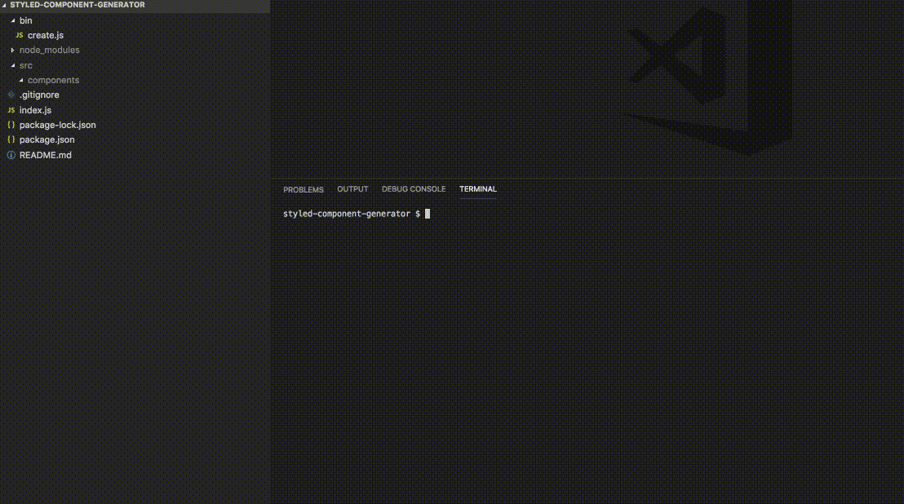

## React Component and Styled Component Generator



##### How to Use

Install module globally


[Styled Component Generator on NPM](https://www.npmjs.com/package/styled-component-generator)


```javascript
npm -i styled-component-generator -g
```

Naviate to react project root

```javacsript
cst ComponentOneName ComponentTwoName etc...
```

Generated Structure after running cst will be
```
src
│
└───components
│   └───ComponentOneName
│       └───index.js
│       └───styled.js
│   └───ComponentTwoName
│       └───index.js
│       └───styled.js
```

##### Add-Ons in Future
Add options to select from pre-existing component templates

